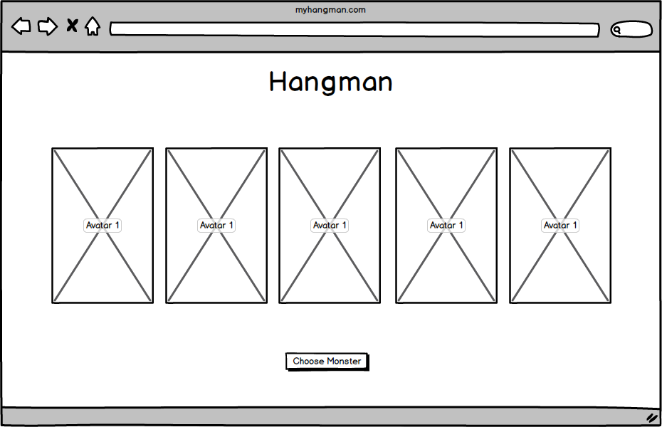
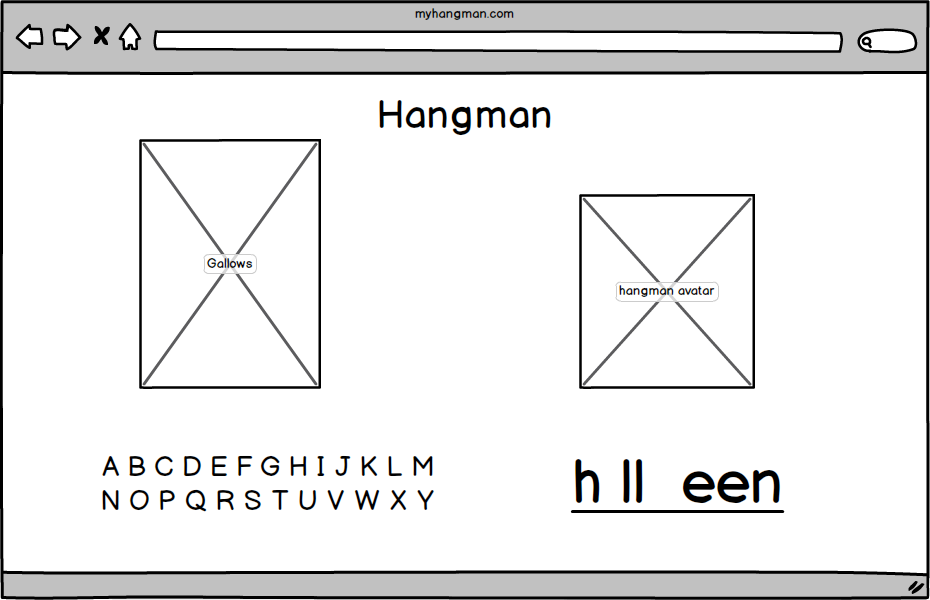
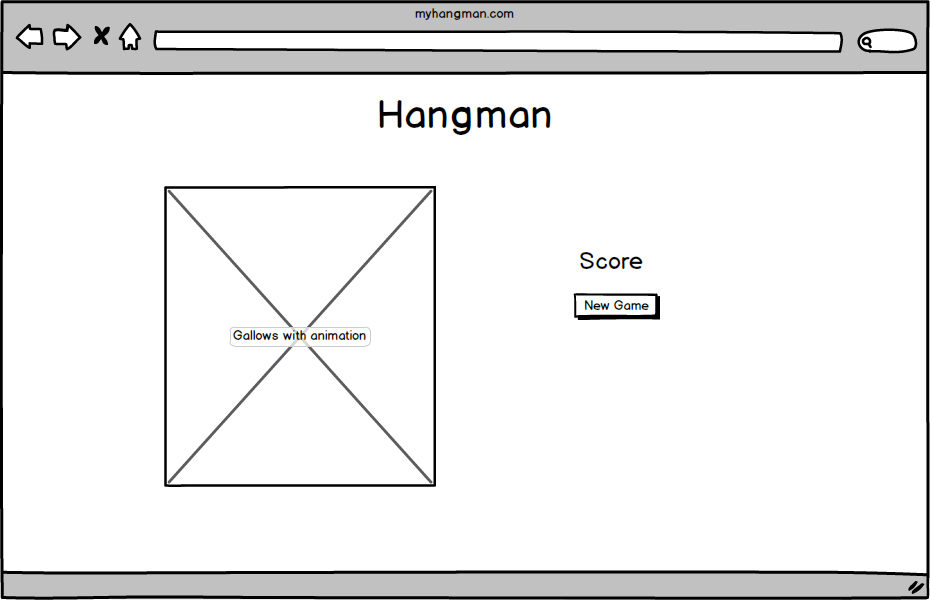

#Hangman readme

[Hangman Game](http://jrvleet.github.io/Hangman/)

I decided to take my games title very literally and make it visually grim. It *is* October so nows the perfect time to make a Halloween themed game.

##Photoshop Mock-Up

##Balsamiq Mock-Ups

##User Stories

- As a player I would like to press a button in order to start the game.
- As a player I would like to see the blank letterspaces so that I can see how long the word is.
- As a player I would like to see the correct letters fill in the blank spaces. 
- As a player I would like to have a way to choose letters easily
- As a player I would like to see all the letters I've used.
- As a player I would like to see my hangman character to show how many body parts have moved to the noose
- As a player I'd like to see something different happen to the hangman character depending on whether I win or lose.
- As a player I'd like for there to be a button to start a new game when I finish each game.
- As a player I'd like to see a counter of wins and losses.
- As a player I'd like to have multiple hangman characters to choose from.

##MVP
####Current
- [X] As a player I would like to press a button in order to start the game.
- [X] As a player I would like to see the blank letterspaces so that I can see how long the word is.
- [X] As a player I would like to have a way to choose letters easily
- [X] As a player I would like to see the correct letters fill in the blank spaces.
- [ ] As a player I would like to see all the letters I've used.
- [X] As a player I would like to see my hangman character to show how many body parts have moved to the noose
- [ ] As a player I'd like to see something different happen to the hangman character depending on whether I win or lose.
- [ ] As a player I'd like for there to be a button to start a new game when I finish each game.

