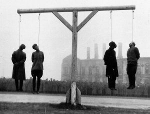
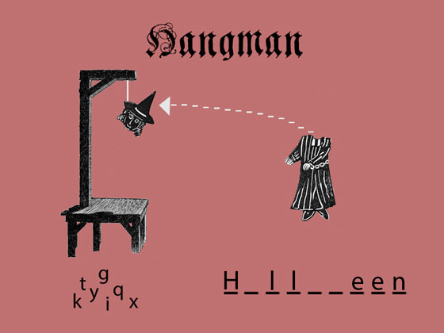

#Hangman readme

I decided to take my games title very literally and make it visually grim. It *is* October so nows the perfect time to make a Halloween themed game.

##Photoshop Mock-Up

##User Stories

- As a player I would like to press a button in order to start the game.
- As a player I would like to see the blank letterspaces so that I can see how long the word is.
- As a player I would like to see the correct letters fill in the blank spaces. 
- As a player I would like to see the wrong letters show up on the side so I can see what letters I've already picked.
- As a player I would like to see my hangman character disassemble and reassemble, peice by peice, at the noose so that I can see how close my character is to being hanged.
- As a player I'd like the outcome of this game to be fun weather I win or lose. 
- As a player I'd like to see a different animation of the hangman character depending on the outcome.
- As a player I'd like for there to be a button to start a new game when I finish each game.
- As a player I'd like to see a counter of wins and losses.
- As a player I'd like to have multiple hangman characters to choose from.

##MVP
####Current
- [ ] As a player I would like to press a button in order to start the game.
- [ ]As a player I would like to see the blank letterspaces so that I can see how long the word is.
- [ ]As a player I would like to see the correct letters fill in the blank spaces. 
- [ ]As a player I would like to see the wrong letters show up on the side so I can see what letters I've already picked.
- [ ]As a player I would like to see my hangman character disassemble and reassemble, peice by peice, at the noose so that I can see how close my character is to being hanged.

